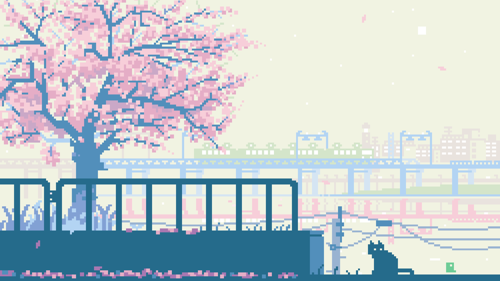

<div align="center">

</div>

<br>

I build things, I break them,<br>
Blaze way down the rebel path.

<br>

[**synaps**](https://github.com/HaseebKhalid1507/SynapsCLI) - agent runtime. rust, 20ms cold start.<br>
[**axel**](https://github.com/HaseebKhalid1507/axel) - search, memory and session state in one file.<br>
[**velocirag**](https://github.com/HaseebKhalid1507/VelociRAG) - retrieval for agents. no pytorch, no gpu.<br>
[**glyph**](https://github.com/HaseebKhalid1507/Glyph) - mcp scanner. tested against real cves.<br>
[**myx**](https://github.com/HaseebKhalid1507/Myx) - spotify in the terminal. themes follow the album art.

<br>

```console
$ cargo install synaps
```

<br>


